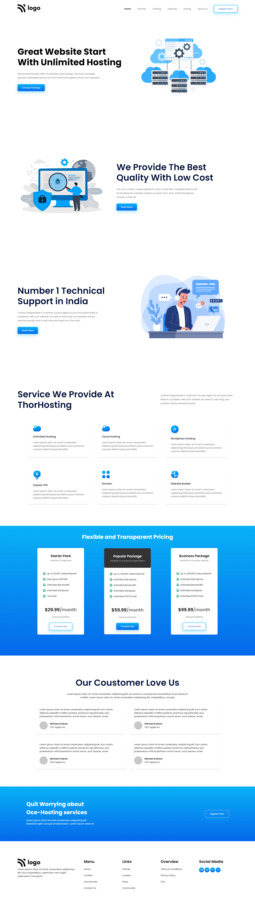

# Project_11 - HTML  and CSS 

---

## Project 11 [Live Link](https://project-11-themohitgupta.netlify.app)

---
## What I learned from this Project?
- Learnd about creating **full fledged** website.
- Learnd about creating complex cards by creating **different sections**.
- Learnd about **pseudo elements**.
- Learnd about **banner** and **footer**. 
---

### This Project took me around **8 hours** to complete.

---

---
